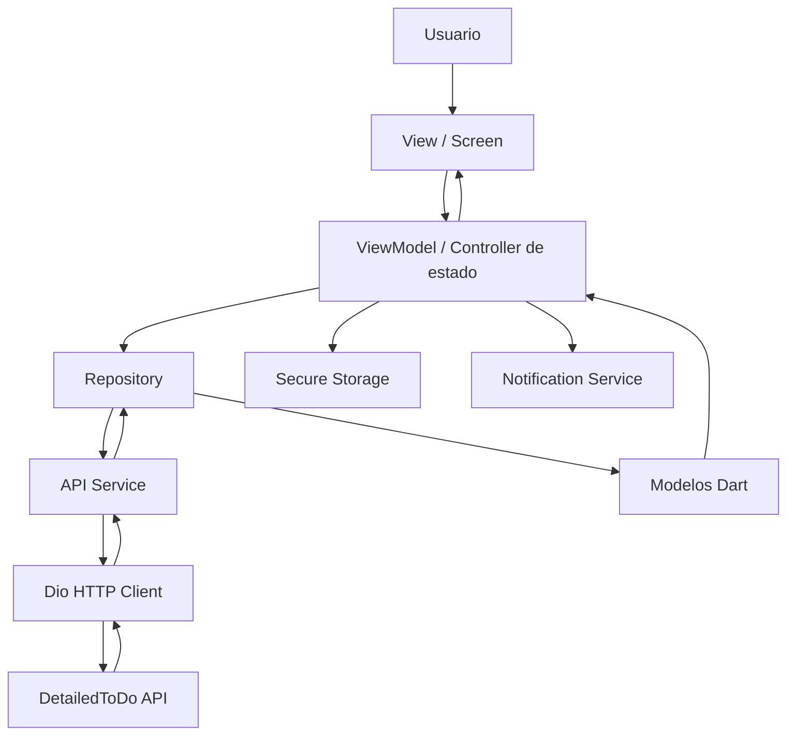
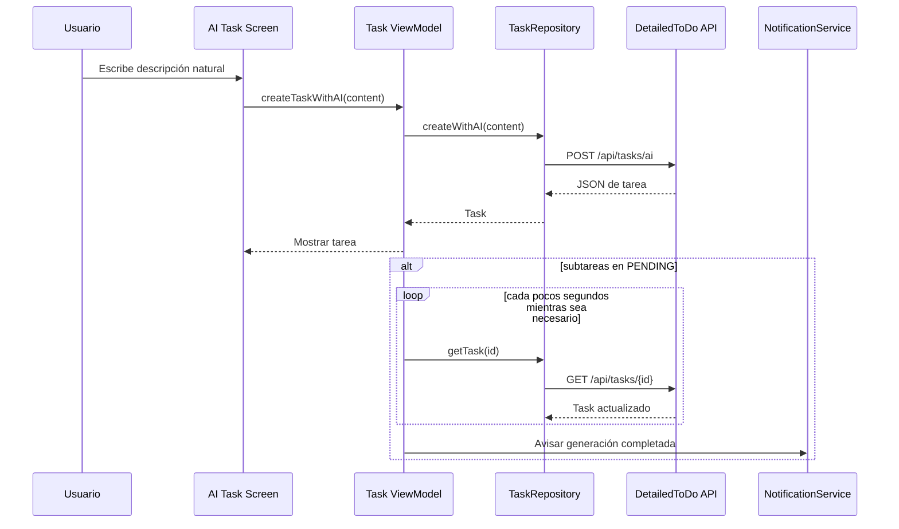
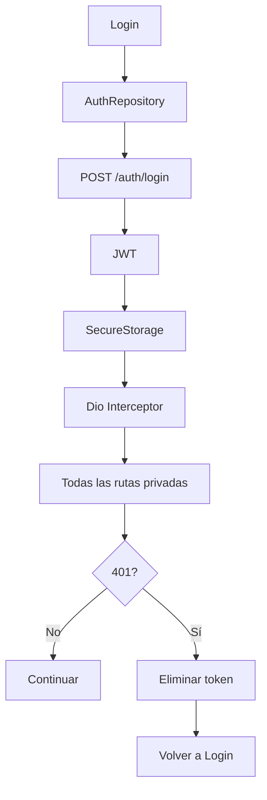
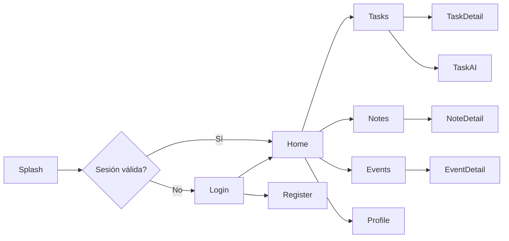
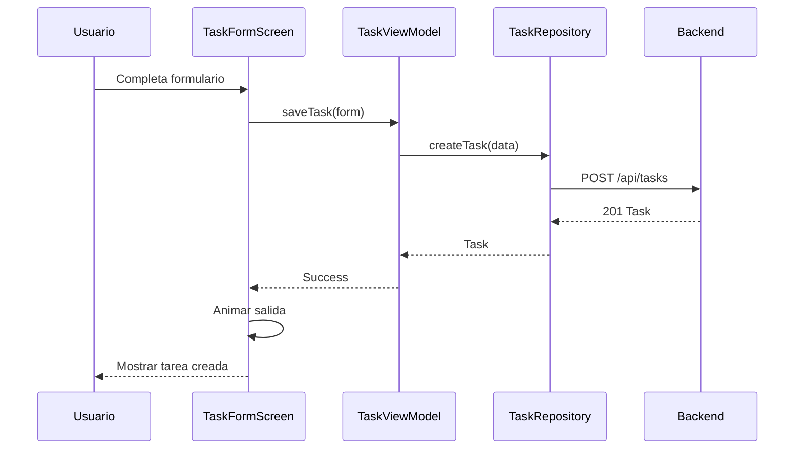
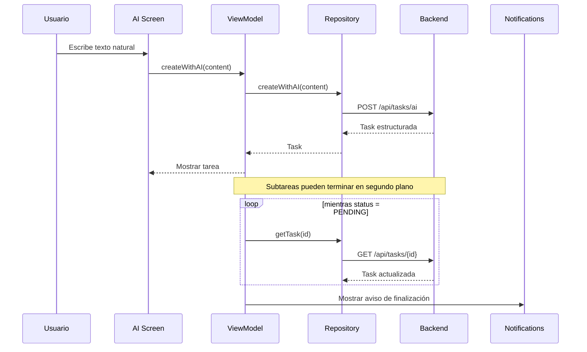
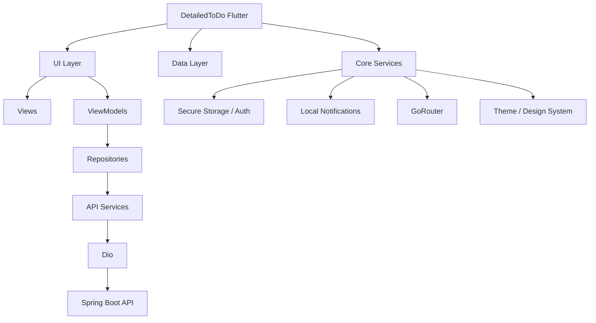

# DetailedToDo — Arquitectura Flutter, flujo interno y diseño de la app

> Documento de referencia para construir el cliente Flutter de **DetailedToDo** sobre la API REST ya desarrollada.
>
> Alcance: interfaz, navegación, arquitectura interna del cliente, manejo de estado, consumo de API, autenticación, IA, notificaciones, animaciones, iconografía y estructura de carpetas.
>
> Este documento no define todavía cambios del backend ni pasarela de pagos.

---

## 1. Objetivo del cliente Flutter

DetailedToDo debe sentirse como una aplicación de organización personal rápida y limpia, no como un formulario que simplemente consume una API.

La idea central del cliente es:

**entrada rápida → interpretación/organización → visualización clara → seguimiento de la actividad.**

El usuario podrá trabajar con tres recursos principales:

- **Notas:** información libre que quiere guardar y consultar.
- **Tareas:** actividades con prioridad, fecha límite, recordatorio, carpeta, etiquetas y subtareas.
- **Eventos:** actividades asociadas a una fecha y hora.

La IA será una capa de creación asistida. El usuario escribe una descripción natural y la aplicación solicita al backend que convierta ese contenido en una estructura usable.

La API ya contempla autenticación JWT, CRUD para notas/tareas/eventos, subtareas, cambio de estado, filtros y operaciones de IA.

---

# 2. Arquitectura general de Flutter

Se recomienda separar la aplicación en **UI + Data**, utilizando un estilo MVVM: cada funcionalidad importante tendrá una View, un ViewModel, un Repository y los Services necesarios. Este enfoque coincide con la arquitectura recomendada actualmente por la documentación oficial de Flutter. urlDocumentación oficial de arquitectura de Flutterhttps://docs.flutter.dev/app-architecture/guide

La regla principal será:

> **La pantalla no conoce HTTP, JWT ni JSON. La pantalla sólo conoce estado y acciones.**

### Flujo principal



### Responsabilidades

| Capa | Responsabilidad | Ejemplo |
|---|---|---|
| View | Renderizar UI y capturar interacción | `TaskDetailScreen` |
| ViewModel | Manejar estado y acciones de la pantalla | `TaskDetailViewModel` |
| Repository | Fuente de verdad y reglas de acceso a datos | `TaskRepository` |
| Service | Traducir acciones a endpoints HTTP | `TaskApiService` |
| Model | Representar respuestas JSON en Dart | `Task`, `Subtask` |
| Core | Servicios transversales | `Auth`, `Notifications`, `Theme` |

Flutter también recomienda que los repositories funcionen como fuente de verdad de los datos y que los services se limiten a envolver las fuentes externas, como APIs REST o servicios de plataforma. urlArquitectura de datos de Flutterhttps://docs.flutter.dev/app-architecture/guide

---

# 3. Dependencias recomendadas

La primera versión debe mantenerse relativamente pequeña. No conviene instalar diez paquetes para hacer lo que Flutter ya puede hacer por sí mismo.

## Dependencias principales

```bash
flutter pub add dio
flutter pub add flutter_riverpod
flutter pub add go_router
flutter pub add flutter_secure_storage
flutter pub add flutter_local_notifications
flutter pub add intl
flutter pub add phosphor_flutter
```

### Para qué se utilizará cada una

| Dependencia | Uso |
|---|---|
| `dio` | Cliente HTTP, interceptores, headers, manejo de errores y peticiones REST |
| `flutter_riverpod` | Estado de aplicación y ViewModels |
| `go_router` | Navegación y protección de rutas |
| `flutter_secure_storage` | Guardar el JWT de forma segura |
| `flutter_local_notifications` | Recordatorios locales y aviso de generación de IA |
| `intl` | Fechas, horas y formatos locales |
| `phosphor_flutter` | Iconografía consistente, sin emojis |

Flutter recomienda `go_router` para la mayoría de aplicaciones que necesitan navegación estructurada, y recomienda separar la UI de la capa de datos. urlRecomendaciones de arquitectura de Flutterhttps://docs.flutter.dev/app-architecture/recommendations

### Dependencias que NO hacen falta inicialmente

No instalar todavía:

- `freezed`
- `retrofit`
- `hive`
- `isar`
- `bloc`
- `get_it`
- `equatable`
- un paquete de animaciones gigante

Primero se puede construir la aplicación con Dart, Riverpod y los servicios anteriores. Luego se añade una herramienta sólo cuando resuelva un problema real.

---

# 4. Estructura de carpetas

La estructura debe organizarse por responsabilidad y por funcionalidad.

```text
lib/
│
├── main.dart
│
├── app/
│   ├── app.dart
│   ├── router.dart
│   ├── theme.dart
│   └── config/
│       └── app_config.dart
│
├── core/
│   ├── network/
│   │   ├── dio_client.dart
│   │   ├── auth_interceptor.dart
│   │   └── api_exception.dart
│   │
│   ├── storage/
│   │   └── secure_storage_service.dart
│   │
│   ├── notifications/
│   │   └── notification_service.dart
│   │
│   ├── widgets/
│   │   ├── app_button.dart
│   │   ├── app_text_field.dart
│   │   ├── app_card.dart
│   │   ├── loading_view.dart
│   │   └── empty_state.dart
│   │
│   └── utils/
│       ├── date_utils.dart
│       └── validators.dart
│
├── features/
│   │
│   ├── auth/
│   │   ├── data/
│   │   │   ├── auth_api_service.dart
│   │   │   └── auth_repository.dart
│   │   ├── models/
│   │   │   └── user.dart
│   │   ├── viewmodels/
│   │   │   └── auth_view_model.dart
│   │   └── views/
│   │       ├── splash_screen.dart
│   │       ├── login_screen.dart
│   │       └── register_screen.dart
│   │
│   ├── home/
│   │   ├── viewmodels/
│   │   │   └── home_view_model.dart
│   │   └── views/
│   │       └── home_screen.dart
│   │
│   ├── tasks/
│   │   ├── data/
│   │   │   ├── task_api_service.dart
│   │   │   └── task_repository.dart
│   │   ├── models/
│   │   │   ├── task.dart
│   │   │   └── subtask.dart
│   │   ├── viewmodels/
│   │   │   ├── tasks_view_model.dart
│   │   │   └── task_detail_view_model.dart
│   │   └── views/
│   │       ├── tasks_screen.dart
│   │       ├── task_detail_screen.dart
│   │       ├── task_form_screen.dart
│   │       └── ai_task_screen.dart
│   │
│   ├── notes/
│   │   ├── data/
│   │   │   ├── note_api_service.dart
│   │   │   └── note_repository.dart
│   │   ├── models/
│   │   │   └── note.dart
│   │   ├── viewmodels/
│   │   │   └── notes_view_model.dart
│   │   └── views/
│   │       ├── notes_screen.dart
│   │       ├── note_detail_screen.dart
│   │       └── note_form_screen.dart
│   │
│   ├── events/
│   │   ├── data/
│   │   │   ├── event_api_service.dart
│   │   │   └── event_repository.dart
│   │   ├── models/
│   │   │   └── event.dart
│   │   ├── viewmodels/
│   │   │   └── events_view_model.dart
│   │   └── views/
│   │       ├── events_screen.dart
│   │       ├── event_detail_screen.dart
│   │       └── event_form_screen.dart
│   │
│   └── profile/
│       ├── data/
│       │   └── user_repository.dart
│       ├── viewmodels/
│       │   └── profile_view_model.dart
│       └── views/
│           └── profile_screen.dart
│
└── shared/
    └── models/
        ├── api_error.dart
        └── ai_quota.dart
```

---

# 5. Sistema visual de DetailedToDo

## 5.1 Identidad visual

La aplicación utilizará una estética **monocromática**:

- Fondo principal: negro o gris muy oscuro.
- Superficies: gris oscuro.
- Elementos secundarios: gris medio.
- Texto principal: blanco.
- Texto secundario: gris claro.
- Bordes: gris discreto.
- Blanco puro únicamente para elementos que deban destacar.

No se utilizarán colores saturados como parte principal de la marca.

La aplicación debe sentirse:

**minimalista + seria + limpia + tecnológica + tranquila.**

No debe parecer una aplicación empresarial llena de paneles ni una aplicación escolar recargada.

## 5.2 Tema

```text
Scaffold background     → #0B0B0B
Primary surface         → #151515
Secondary surface       → #1E1E1E
Border                  → #2A2A2A
Primary text            → #FFFFFF
Secondary text          → #A7A7A7
Disabled text           → #656565
Input background        → #171717
```

Estos valores son una guía visual; deben centralizarse en `theme.dart` y nunca escribirse repetidamente dentro de cada pantalla.

## 5.3 Tipografía

Utilizar una tipografía sans-serif limpia. La aplicación debe priorizar:

- títulos grandes y cortos;
- textos secundarios pequeños pero legibles;
- buena separación vertical;
- números y fechas fácilmente distinguibles.

No utilizar demasiados pesos de fuente.

---

# 6. Iconografía

No utilizar emojis como iconos de navegación o acciones.

Se utilizará **Phosphor Icons**, con un peso consistente.

Ejemplos conceptuales:

| Función | Icono |
|---|---|
| Inicio | `House` |
| Tareas | `CheckCircle` |
| Notas | `Note` |
| Eventos | `CalendarBlank` |
| Perfil | `UserCircle` |
| Crear | `Plus` |
| Editar | `PencilSimple` |
| Eliminar | `Trash` |
| Buscar | `MagnifyingGlass` |
| Filtrar | `FunnelSimple` |
| Carpeta | `FolderSimple` |
| Etiqueta | `Tag` |
| Prioridad | `Flag` |
| Recordatorio | `Bell` |
| IA | `Sparkle` |
| Volver | `ArrowLeft` |
| Más opciones | `DotsThreeVertical` |

Regla visual:

> Un mismo concepto debe usar siempre el mismo icono en toda la aplicación.

Por ejemplo, `Bell` siempre representa recordatorio. No cambiarlo de una pantalla a otra.

---

# 7. Navegación principal

La aplicación móvil tendrá una navegación inferior con cuatro secciones principales:

```text
┌──────────────────────────────────────────────┐
│                                              │
│                  CONTENIDO                   │
│                                              │
├──────────────────────────────────────────────┤
│  Inicio      Tareas      Notas      Eventos  │
└──────────────────────────────────────────────┘
```

El perfil quedará accesible desde la cabecera de Inicio, no como quinta pestaña.

La creación de contenido se realizará mediante un botón flotante central o un botón de acción claramente visible.

Al pulsarlo aparecerá una hoja inferior:

```text
           Nueva creación

       [ Tarea ] [ Nota ] [ Evento ]

       [ Crear con IA ]
```

La acción `Crear con IA` no crea un cuarto tipo de recurso. Simplemente inicia el flujo asistido para crear una tarea, nota o evento.

---

# 8. Pantallas de la aplicación

## 8.1 Splash / restauración de sesión

Objetivo: decidir si existe una sesión válida antes de mostrar la aplicación.

Flujo:

```text
Splash
  │
  ├── JWT no existe → Login
  │
  └── JWT existe
        │
        └── GET /users/me
              ├── 200 → Home
              └── 401 → limpiar sesión → Login
```

No debe haber un formulario visible durante este proceso.

---

## 8.2 Login

Elementos:

- Logo/nombre DetailedToDo.
- Campo correo.
- Campo contraseña.
- Botón `Iniciar sesión`.
- Enlace `Crear cuenta`.
- Indicador de carga mientras se realiza el POST.

Endpoint:

```http
POST /api/auth/login
```

La API devuelve `token` y `user`. El token se guarda en almacenamiento seguro y se utiliza posteriormente como Bearer token.

---

## 8.3 Registro

Campos:

- Nombre.
- Correo.
- Contraseña.
- Confirmación de contraseña.

Endpoint:

```http
POST /api/auth/register
```

Después del registro exitoso, el cliente puede llevar al usuario al login.

---

# 9. Home

La Home no debe ser un dashboard corporativo.

Debe mostrar rápidamente:

```text
Buenos días, Carlos

Hoy
────────────────────────────────
3 tareas pendientes
1 evento próximo
2 recordatorios

Próximas tareas
────────────────────────────────
[ Tarjeta de tarea ]
[ Tarjeta de tarea ]

           [+]
```

El objetivo de Home es responder tres preguntas:

1. ¿Qué tengo pendiente?
2. ¿Qué viene pronto?
3. ¿Qué puedo crear rápidamente?

La información se obtiene de los repositories de tareas y eventos, no de una nueva API de dashboard.

---

# 10. Tareas

## Lista

La pantalla de tareas será una lista de tarjetas compactas.

Cada tarjeta puede mostrar:

```text
┌─────────────────────────────────────────┐
│ Estudiar minería de datos       [HIGH]  │
│ Repasar conceptos                     │
│                                         │
│ Universidad   •   viernes 2 oct.       │
│                                         │
│ ○ 2/4 subtareas                        │
└─────────────────────────────────────────┘
```

La tarjeta no debe mostrar absolutamente todos los campos.

## Filtros

La API soporta filtros por:

- `status`
- `priority`
- `folder`
- `tag`

Por lo tanto, Flutter tendrá una hoja de filtros que genere estos parámetros sólo cuando existan.

Estados soportados:

```text
PENDING
IN_PROGRESS
COMPLETED
```

Prioridades:

```text
LOW
MEDIUM
HIGH
```

---

# 11. Detalle de tarea

El detalle debe ser una pantalla visualmente fuerte porque es el recurso principal de DetailedToDo.

```text
← Tarea

Estudiar minería de datos

Repasar conceptos.

HIGH      Universidad      viernes 2 oct.

────────────────────────────────

Subtareas

□ Leer material
□ Instalar RStudio
□ Resolver ejercicios

[ + Nueva subtarea ]

────────────────────────────────

Recordatorio
2 de octubre · 08:00

[ Editar ]       [ Completar ]
```

El cambio rápido de estado utiliza:

```http
PATCH /api/tasks/{id}/status
```

La aplicación debe actualizar visualmente la tarjeta inmediatamente y sincronizar el resultado con el servidor.

---

# 12. Crear tarea manualmente

Formulario:

- Título.
- Descripción.
- Prioridad.
- Fecha límite.
- Fecha de recordatorio.
- Carpeta.
- Etiquetas.

Endpoint:

```http
POST /api/tasks
```

El mismo modelo se utilizará para `PUT /api/tasks/{id}`.

---

# 13. Crear tarea con IA

Esta debe ser una de las pantallas más importantes de la aplicación.

La pantalla será intencionalmente sencilla:

```text
Crear con IA

Cuéntame qué necesitas hacer
────────────────────────────────
Tengo que entregar la actividad de
minería de datos este viernes y usar
RStudio.
────────────────────────────────

              [ Crear ]
```

No se debe obligar al usuario a rellenar 7 campos antes de usar IA.

Flujo:



La API acepta un cuerpo `{"content":"..."}` para las operaciones de IA y especifica que la tarea puede devolver sus subtareas generadas en segundo plano.

### Estado visual de IA

Durante la generación:

```text
Subtareas

Generando subtareas...

○ ○ ○
```

Cuando termina:

```text
Subtareas

✓ Preparar entorno
✓ Leer material
○ Resolver ejercicios
```

No bloquear toda la pantalla mientras las subtareas se generan.

---

# 14. Notas

## Lista

La lista puede utilizar tarjetas o una cuadrícula compacta dependiendo del tamaño de pantalla.

Cada tarjeta muestra:

- Título.
- Primeras líneas del contenido.
- Carpeta.
- Etiquetas.

La API permite filtrar notas por `folder` y `tag`.

## Nota detallada

La lectura de una nota debe parecer más cercana a un documento que a una tarjeta.

Acciones:

```text
Editar   Compartir posteriormente   Eliminar
```

La función de compartir no forma parte todavía de la API, por lo que visualmente no debe implementarse como una función real en esta versión.

---

# 15. Eventos

La pantalla de eventos debe priorizar fechas y horas.

Cada evento mostrará:

```text
02 OCT
10:00

Presentación
Proyecto final
```

La API permite consultar eventos usando `from` y `to` en formato ISO-8601.

Una vista inicial sencilla puede mostrar una lista cronológica. No es obligatorio construir inmediatamente un calendario complejo.

---

# 16. Perfil y sesión

La pantalla de perfil tendrá:

```text
Carlos
carlos@email.com

Cuenta
────────────────
Plan actual
Uso de IA

Preferencias
────────────────
Notificaciones
Tema

Sesión
────────────────
Cerrar sesión
```

El usuario se obtiene desde:

```http
GET /api/users/me
```

y se actualiza mediante:

```http
PUT /api/users/me
```

La API establece que Flutter no debe enviar `userId`; el propietario de los recursos se obtiene desde el JWT.

---

# 17. Cuota de IA

La API expone:

```http
GET /api/ai/quota
```

Los límites documentados son:

```text
Free → 5 solicitudes/día
Plus → 15 solicitudes/día
```

La interfaz puede mostrar algo como:

```text
IA

3 de 5 solicitudes utilizadas hoy
████████░░
```

No construir todavía una pantalla de compra, porque el contrato entregado no expone endpoints de pago o suscripción. Esa parte puede diseñarse posteriormente.

Los límites y el comportamiento de cuota están definidos en la documentación de consumo de la API.

---

# 18. Capa de modelos Dart

Cada respuesta JSON debe convertirse a un modelo Dart.

Modelos mínimos:

```text
User
Note
Task
Subtask
Event
AIQuota
ApiError
```

Enums:

```text
TaskStatus
Priority
SubtasksGenerationStatus
```

Ejemplo conceptual:

```dart
class Task {
  final String id;
  final String title;
  final String? description;
  final Priority priority;
  final DateTime? dueDate;
  final DateTime? reminderDate;
  final String? folder;
  final List<String> tags;
  final List<Subtask> subtasks;
  final String? subtasksGenerationStatus;

  const Task({
    required this.id,
    required this.title,
    this.description,
    required this.priority,
    this.dueDate,
    this.reminderDate,
    this.folder,
    required this.tags,
    required this.subtasks,
    this.subtasksGenerationStatus,
  });

  factory Task.fromJson(Map<String, dynamic> json) {
    // Mapear aquí exactamente el JSON entregado por Spring Boot.
    throw UnimplementedError();
  }
}
```

No colocar peticiones HTTP dentro de `Task`.

---

# 19. API Service

Cada recurso tendrá su propio service.

### TaskApiService

```text
getTasks()
getTask(id)
createTask(data)
updateTask(id, data)
updateStatus(id, status)
deleteTask(id)
createSubtask(taskId, data)
updateSubtask(taskId, subtaskId, data)
deleteSubtask(taskId, subtaskId)
createTaskWithAI(content)
generateSubtasksWithAI(taskId)
```

### NoteApiService

```text
getNotes()
getNote(id)
createNote(data)
updateNote(id, data)
deleteNote(id)
createNoteWithAI(content)
```

### EventApiService

```text
getEvents(from, to)
getEvent(id)
createEvent(data)
updateEvent(id, data)
deleteEvent(id)
createEventWithAI(content)
```

### AuthApiService

```text
register(data)
login(data)
getCurrentUser()
updateCurrentUser(data)
```

---

# 20. Repository

El repository será la fuente de verdad de cada recurso.

Ejemplo conceptual:

```text
TaskScreen
     ↓
TaskViewModel
     ↓
TaskRepository
     ↓
TaskApiService
     ↓
Dio
     ↓
Spring Boot
```

La ViewModel no debería saber que existe `/api/tasks`.

En lugar de:

```dart
viewModel.dio.get('/tasks');
```

debe utilizar:

```dart
viewModel.loadTasks();
```

Y el ViewModel delega en:

```dart
repository.getTasks(...)
```

Esto mantiene las pantallas independientes del backend y facilita pruebas y cambios futuros.

---

# 21. Manejo del JWT

El flujo de autenticación debe ser centralizado.



El cliente enviará:

```http
Authorization: Bearer <token>
Content-Type: application/json
```

El contrato actual indica que todas las rutas, excepto `register` y `login`, requieren Bearer token.

### Regla importante

Nunca guardar el JWT en:

- variables globales permanentes;
- archivos de texto plano;
- preferencias normales si el objetivo es almacenamiento seguro.

Usar `flutter_secure_storage`.

---

# 22. Dio e interceptor

El `DioClient` debe centralizar:

- `baseUrl`;
- timeout;
- headers;
- JWT;
- manejo de 401;
- traducción de errores.

Ejemplo conceptual:

```text
DioClient
 ├── baseUrl
 ├── connectTimeout
 ├── receiveTimeout
 └── AuthInterceptor
       └── Authorization: Bearer <token>
```

No crear una instancia de `Dio` dentro de cada pantalla.

---

# 23. Manejo de errores

La API usa una estructura común:

```json
{
  "status": 400,
  "error": "...",
  "message": "...",
  "timestamp": "..."
}
```

Y documenta, entre otros:

```text
400 → validación
401 → token inválido/ausente
403 → sin permiso
404 → recurso inexistente o perteneciente a otro usuario
409 → correo repetido
```


El usuario no debería ver mensajes técnicos de Spring.

Ejemplo de traducción de UI:

```text
401 → "Tu sesión ha expirado. Inicia sesión nuevamente."
409 → "Ese correo ya está registrado."
500 → "No pudimos completar la operación. Inténtalo nuevamente."
```

---

# 24. Estados de cada pantalla

Todas las pantallas que consuman API deben contemplar como mínimo:

```text
Loading
Success
Empty
Error
Refreshing
```

Ejemplo:

```dart
enum ViewState {
  initial,
  loading,
  success,
  empty,
  error,
  refreshing,
}
```

No utilizar `CircularProgressIndicator` para absolutamente todo. Algunas operaciones pequeñas pueden utilizar indicadores dentro del botón o skeletons.

---

# 25. Animaciones

Las animaciones deben sentirse naturales, no como efectos añadidos porque sí.

## Animaciones recomendadas

### Navegación

Transición corta entre pantallas:

```text
180–280 ms
```

Utilizar `go_router` junto con transiciones personalizadas simples.

### Tarjetas

Cuando una lista aparece:

```text
opacity 0 → 1
+ pequeño desplazamiento vertical
```

### Cambio de estado de tarea

Cuando una tarea pasa a `COMPLETED`:

- transición del checkbox;
- cambio suave de estilo;
- contenido ligeramente atenuado;
- actualización de la lista sin reconstruir toda la pantalla visualmente.

### Modales

Usar `showModalBottomSheet` para filtros, creación y opciones secundarias.

La hoja inferior debe subir suavemente y ocupar sólo el espacio necesario.

### AI

Mientras se procesa una tarea:

```text
Sparkle icon
    ↓
movimiento muy ligero
    ↓
texto "Organizando tu tarea..."
```

No utilizar animaciones largas ni cargadores infinitos exagerados.

Flutter permite que las Views manejen la lógica de animaciones y layout, mientras la lógica de datos permanece fuera de ellas. urlGuía de UI y ViewModels de Flutterhttps://docs.flutter.dev/app-architecture/guide

---

# 26. Responsividad

La aplicación se diseñará primero para teléfono, pero no se debe asumir una única resolución.

Usar:

```text
MediaQuery
LayoutBuilder
SafeArea
Flexible
Expanded
SliverList
```

No depender de:

```dart
width: 400
height: 800
```

De forma rígida.

### Teléfono

Una sola columna.

### Tablet / pantalla ancha

Puede utilizarse:

```text
┌─────────────────┬──────────────────────────┐
│ Lista            │ Detalle                  │
│ de tareas        │ de la tarea seleccionada│
└─────────────────┴──────────────────────────┘
```

Esta adaptación puede llegar después de completar primero la experiencia móvil.

---

# 27. Sistema de creación rápida

El botón `+` debe ser uno de los elementos centrales de la experiencia.

Al presionarlo:

```text
              Crear

        + Tarea
        + Nota
        + Evento

        Sparkle Crear con IA
```

El usuario debe poder llegar a la pantalla de creación en prácticamente un toque.

Esto es especialmente importante para la característica de IA: la IA debe reducir el trabajo de organizar información, no convertirse en un formulario más largo.

---

# 28. Fechas y zonas horarias

La API utiliza valores ISO-8601 para fechas de eventos y las tareas muestran fechas/horas en sus cuerpos JSON.

Flutter debe:

1. convertir JSON a `DateTime`;
2. trabajar internamente con `DateTime`;
3. formatear las fechas sólo en la UI;
4. enviar al backend exactamente el formato esperado.

Nunca mostrar directamente:

```text
2026-10-02T23:59:00
```

En la UI debería verse, por ejemplo:

```text
Viernes 2 de octubre · 11:59 p. m.
```

---

# 29. Notificaciones locales

El backend entrega `reminderDate` para tareas y eventos.

Flutter será responsable de convertir esa fecha en una notificación local del dispositivo.

Flujo:

```text
Crear / editar tarea
        ↓
API guarda reminderDate
        ↓
Flutter recibe tarea
        ↓
NotificationService.schedule()
        ↓
Android muestra recordatorio
```

### Importante para la IA

La API actual documenta generación de subtareas en segundo plano y consulta posterior mediante `GET /tasks/{id}`.

Durante una primera versión, Flutter puede hacer polling mientras la app está activa.

Para recibir un aviso fiable incluso si la aplicación está cerrada, más adelante será preferible incorporar un mecanismo push como FCM y una capacidad equivalente en el backend. La API documentada actualmente no expone un canal push/WebSocket para este propósito, por lo que esa parte no debe fingirse como implementada.

---

# 30. Polling de subtareas IA

Cuando una tarea esté en:

```text
PENDING
```

el ViewModel puede consultar:

```http
GET /api/tasks/{id}
```

cada pocos segundos.

Regla recomendada para MVP:

```text
intervalo: 2–4 segundos
máximo: 30–45 segundos
```

Terminar inmediatamente si:

```text
COMPLETED
FAILED
```

No dejar un Timer ejecutándose después de salir de la pantalla.

El contrato explícitamente indica que el cliente debe consultar posteriormente hasta que `subtasksGenerationStatus` sea `COMPLETED` o `FAILED`.

---

# 31. Estado global vs estado local

No todo necesita ser global.

## Global

```text
Auth session
Current user
App theme
Notification initialization
```

## Local de cada feature

```text
Lista de tareas
Filtros actuales
Formulario de tarea
Estado de generación IA
Formulario de nota
Formulario de evento
```

Esto evita convertir Riverpod en una especie de cajón donde termina absolutamente todo.

---

# 32. Providers recomendados

Conceptualmente:

```text
apiClientProvider
secureStorageProvider
notificationServiceProvider

authRepositoryProvider
authViewModelProvider

TaskRepositoryProvider
TaskListViewModelProvider
TaskDetailViewModelProvider

NoteRepositoryProvider
NoteListViewModelProvider

EventRepositoryProvider
EventListViewModelProvider

UserRepositoryProvider
ProfileViewModelProvider
```

La aplicación debe compartir las instancias principales de services y repositories en lugar de reconstruirlas cada vez que se abre una pantalla.

---

# 33. Router

Rutas conceptuales:

```text
/splash
/login
/register
/home
/tasks
/tasks/:id
/tasks/new
/tasks/ai
/notes
/notes/:id
/notes/new
/events
/events/:id
/events/new
/profile
```

Las rutas privadas deben comprobar el estado de autenticación.



---

# 34. Configuración de la URL del backend

No escribir la URL directamente por toda la aplicación.

Crear:

```text
app/config/app_config.dart
```

Conceptualmente:

```dart
class AppConfig {
  static const apiBaseUrl = String.fromEnvironment(
    'API_BASE_URL',
    defaultValue: 'http://10.0.2.2:8000/api',
  );
}
```

Para Android Emulator, `10.0.2.2` suele utilizarse para alcanzar el host local.

Para dispositivo físico:

```text
http://IP-DE-TU-PC:8000/api
```

Para producción:

```text
https://tu-dominio/api
```

La API documenta actualmente `http://localhost:8000/api` como base local y el mapeo de Docker del puerto `8000:8000`.

---

# 35. Flujo completo de una tarea manual



---

# 36. Flujo completo de una tarea con IA



---

# 37. Qué debe conocer Flutter del backend

Flutter **sí debe conocer**:

```text
URLs de endpoints
Métodos HTTP
JSON de entrada
JSON de salida
Códigos de estado
Enums
JWT
Fechas
Filtros
Estados de generación IA
```

Flutter **no debe conocer**:

```text
MongoDB
Spring Data
Controllers Java
Services Java
Repositories Java
JWT secret
Gemini API key
MongoDB URI
Reglas internas de persistencia
```

La API es el contrato entre ambos mundos.

---

# 38. Seguridad del cliente

No incluir en Flutter:

```text
JWT_SECRET
API_KEY_GEMINI
SPRING_MONGODB_URI
credenciales de MongoDB
```

La IA se invoca mediante el backend:

```text
Flutter
   ↓
Spring Boot
   ↓
Gemini
```

La aplicación móvil sólo necesita el JWT del usuario y la URL pública de la API.

---

# 39. Orden recomendado de implementación

No comenzar haciendo todas las pantallas a la vez.

### Fase 1 — Base visual

```text
main.dart
Theme
Router
Core widgets
Phosphor Icons
Responsividad
```

### Fase 2 — Autenticación

```text
Splash
Login
Register
SecureStorage
Dio Interceptor
AuthRepository
```

### Fase 3 — Tareas

```text
Task model
TaskApiService
TaskRepository
TaskViewModel
TasksScreen
TaskDetailScreen
TaskFormScreen
```

### Fase 4 — IA de tareas

```text
AI Task Screen
POST /tasks/ai
Polling
Subtareas
Estados de generación
Notificación
```

### Fase 5 — Notas

```text
Lista
Detalle
Crear
Editar
Eliminar
Crear con IA
Filtros
```

### Fase 6 — Eventos

```text
Lista cronológica
Detalle
Crear
Editar
Eliminar
Crear con IA
Filtro por rango
```

### Fase 7 — Perfil y cuota

```text
GET /users/me
PUT /users/me
GET /ai/quota
Cerrar sesión
```

### Fase 8 — Refinamiento

```text
Animaciones
Skeletons
Estados vacíos
Errores
Accesibilidad
Responsive tablet
Pruebas
```

---

# 40. Principios que debe seguir el proyecto

### 1. Las Views no hacen HTTP

Incorrecto:

```dart
onPressed: () => dio.post('/tasks')
```

Correcto:

```dart
onPressed: () => viewModel.createTask()
```

### 2. La UI no manipula JWT directamente

El token pertenece a `AuthRepository` / `SecureStorage`.

### 3. Una fuente de verdad por recurso

No tener una lista de tareas distinta en Home, otra en Tasks y otra en TaskDetail sin sincronización.

### 4. El backend decide la verdad de los datos

La UI puede ser optimista visualmente, pero debe terminar sincronizada con el servidor.

### 5. La animación acompaña la acción

No debe retrasar al usuario.

### 6. Menos dependencias, mejor

Instalar un paquete sólo cuando simplifique una responsabilidad real.

### 7. La IA debe sentirse opcional

La aplicación funciona perfectamente sin IA.

### 8. No duplicar lógica

Validaciones simples de UI pueden existir en Flutter, pero las reglas definitivas siguen siendo responsabilidad del backend.

---

# 41. Resumen de infraestructura Flutter



La arquitectura final queda conceptualmente así:

```text
                     DETAILEDTO
                          │
             ┌────────────┴────────────┐
             │                         │
           Flutter                   Backend
             │                         │
      ┌──────┴──────┐                  │
      │             │                  │
     UI          Data Layer            │
      │             │                  │
   Screens      Repository             │
      │             │                  │
  ViewModels    API Service             │
      │             │                  │
      └──────── Dio ┴──────────────────┘
                    │
               Spring Boot
                    │
          MongoDB + Gemini
```

---

# 42. Contrato REST utilizado

La API documentada actualmente tiene como base `http://localhost:8000/api` y define las rutas de autenticación, usuario, notas, tareas, subtareas, eventos e IA utilizadas en este documento.

### Autenticación y usuario

```text
POST /auth/register
POST /auth/login
GET  /users/me
PUT  /users/me
```

### Notas

```text
POST   /notes
GET    /notes
GET    /notes/{id}
PUT    /notes/{id}
DELETE /notes/{id}
POST   /notes/ai
```

### Tareas

```text
POST   /tasks
GET    /tasks
GET    /tasks/{id}
PUT    /tasks/{id}
PATCH  /tasks/{id}/status
DELETE /tasks/{id}
POST   /tasks/ai
POST   /tasks/{id}/subtasks
PATCH  /tasks/{id}/subtasks/{subtaskId}
DELETE /tasks/{id}/subtasks/{subtaskId}
POST   /tasks/{id}/subtasks/ai
```

### Eventos

```text
POST   /events
GET    /events
GET    /events/{id}
PUT    /events/{id}
DELETE /events/{id}
POST   /events/ai
```

### IA

```text
GET /ai/quota
```

El documento original especifica además que los `POST` exitosos devuelven `201`, los borrados `204`, y que las rutas privadas requieren Bearer token.

---

# 43. Resultado esperado de esta arquitectura

Al terminar esta fase, DetailedToDo tendrá un cliente Flutter con:

```text
✓ Diseño monocromático negro/blanco
✓ Iconografía consistente sin emojis
✓ Navegación estructurada
✓ Animaciones suaves
✓ UI responsive
✓ JWT almacenado de forma segura
✓ Cliente HTTP centralizado
✓ Repositories separados por recurso
✓ ViewModels independientes de HTTP
✓ CRUD de tareas, notas y eventos
✓ Subtareas
✓ Filtros
✓ Creación asistida por IA
✓ Polling de generación de subtareas
✓ Cuota de IA visible
✓ Recordatorios locales
✓ Manejo centralizado de errores
✓ Base preparada para Android y posteriormente otras plataformas
```

La prioridad debe ser que **la app funcione correctamente con el contrato actual antes de introducir nuevas capas de complejidad**.

---

# 44. Próximo bloque de trabajo

El siguiente bloque lógico de desarrollo en Flutter es:

```text
1. Crear proyecto Flutter
2. Instalar dependencias
3. Crear theme.dart
4. Crear router.dart
5. Crear DioClient
6. Crear SecureStorageService
7. Crear AuthRepository
8. Crear AuthViewModel
9. Crear Login/Register/Splash
10. Probar login real contra Docker
11. Crear Task model/service/repository/viewmodel
12. Crear primera pantalla real de tareas
```

A partir de ahí, el resto de features se construyen repitiendo la misma estructura sin mezclar UI con HTTP.
